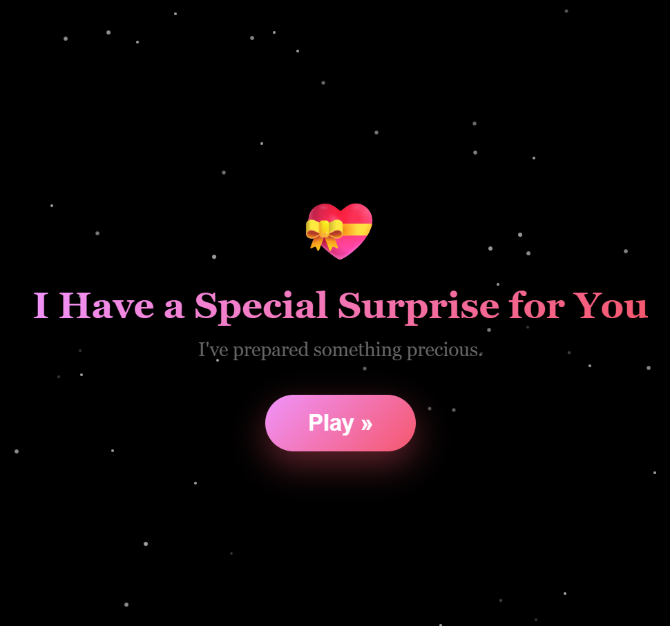
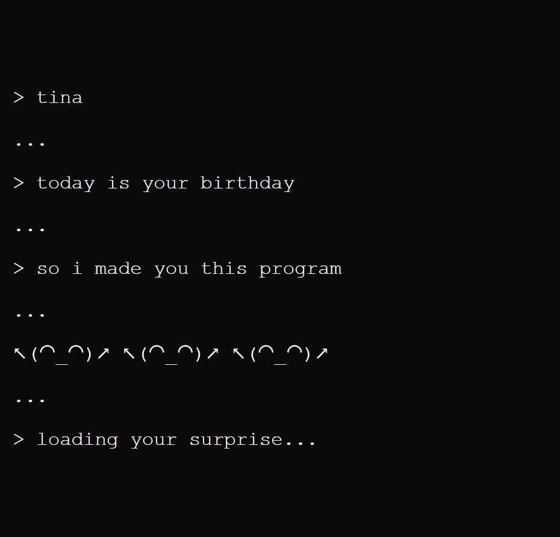
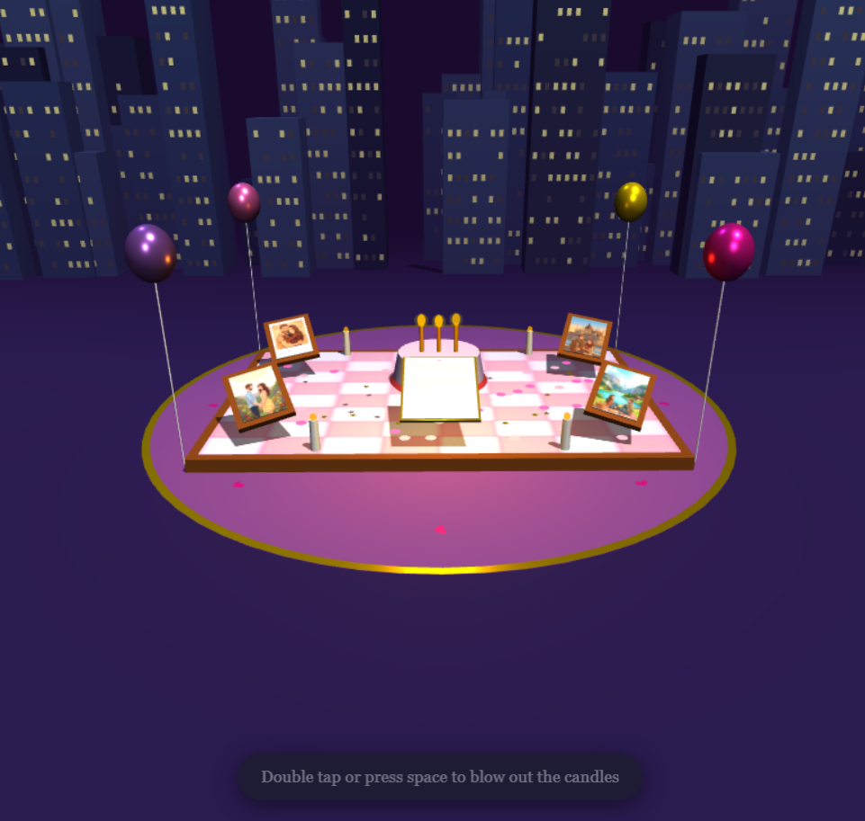
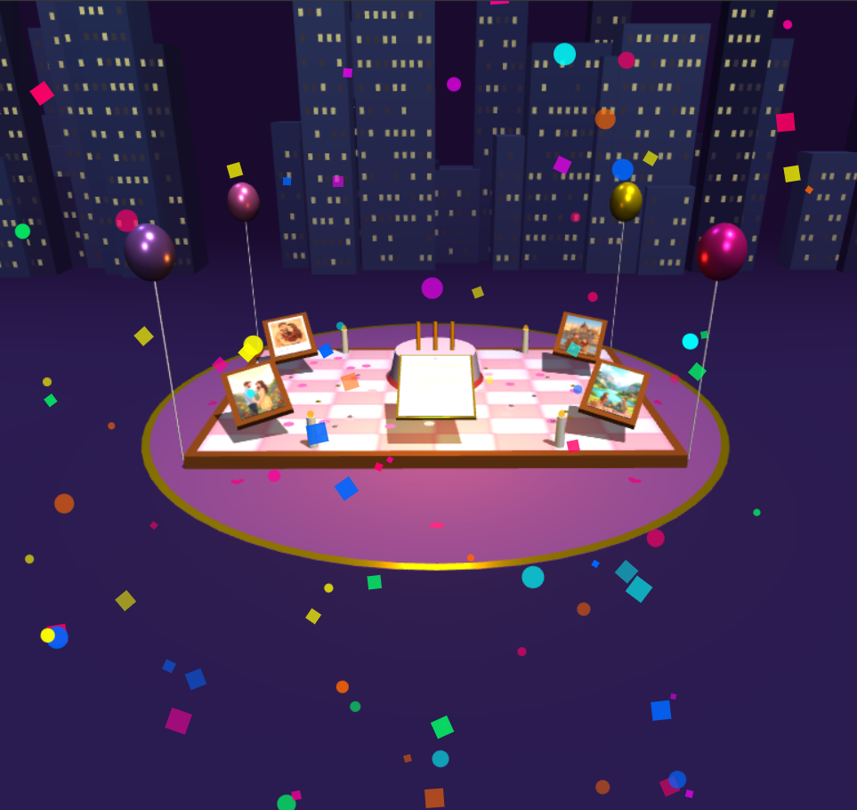
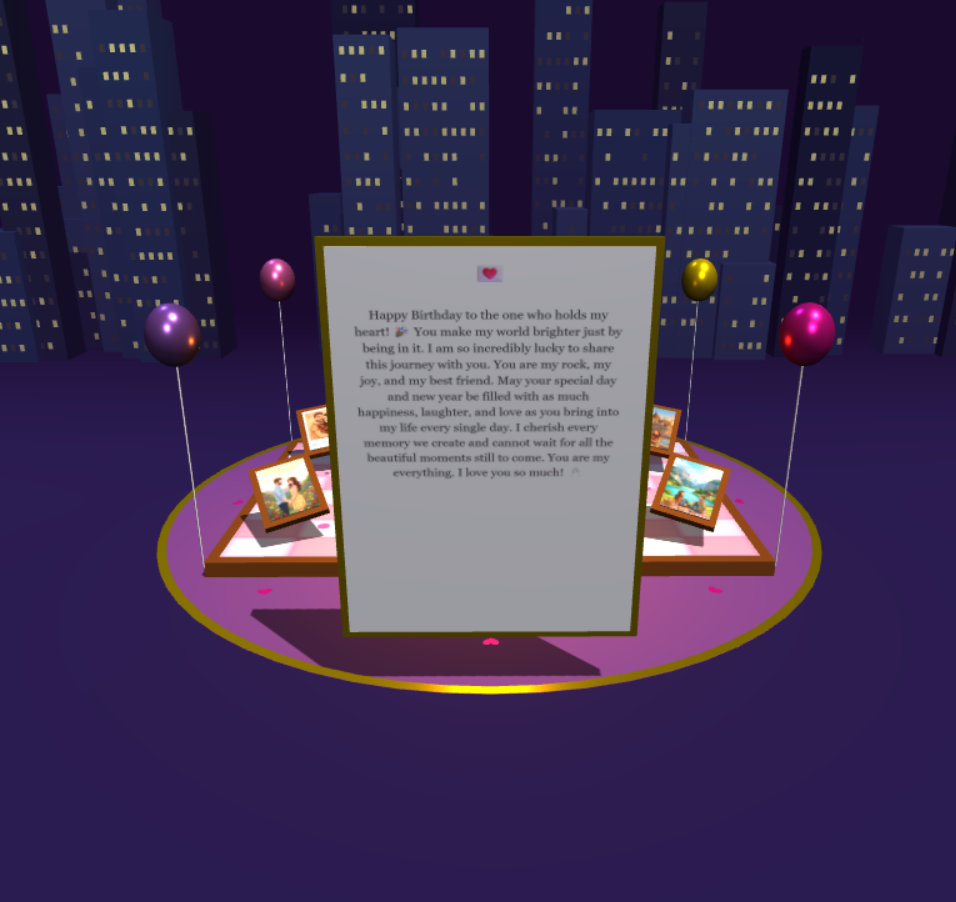
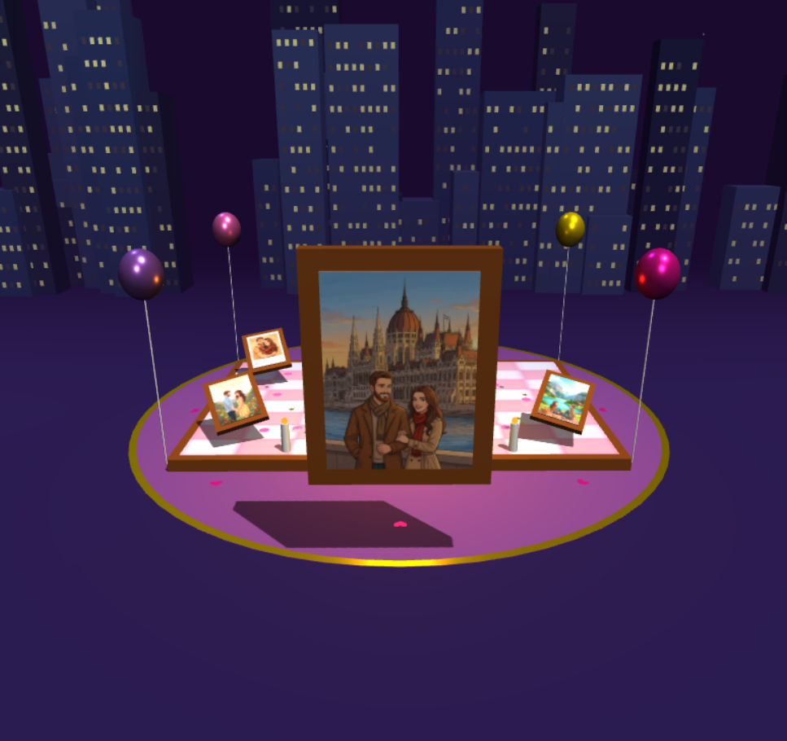
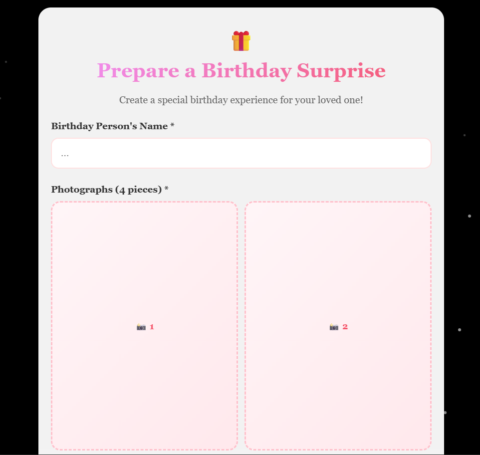
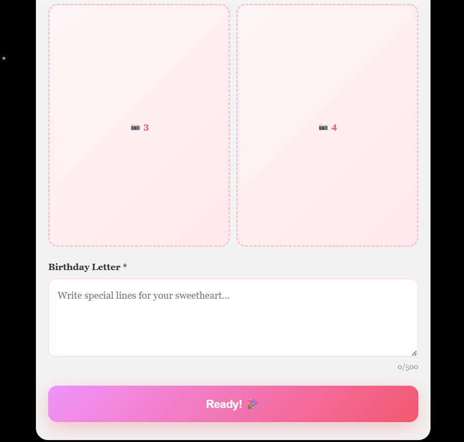

# Birthday-Surpise
A sweet web-based birthday surprise.

🔗 **Prepare a birthday surprise!:** https://semihalp.github.io/Birthday-Surpise/

## Features:
- Dynamic Content Creation: Users can fully personalize the webpage by inputting custom names, uploading photos, and writing heartfelt letters.
- Interactive UX: Gamified interactions, such as a "candle blowing" simulation that responds to user input.
- Responsive Design: A fluid interface ensuring a seamless experience across both mobile and desktop devices.
- Media Integration: Synchronized visual and audio elements to create an immersive celebratory atmosphere.

## Tech Stack: 
- HTML5 & CSS3: Semantic markup and responsive layouts using CSS Grid/Flexbox.
- JavaScript (ES6+): Advanced DOM manipulation, Event Listeners, and dynamic logic control.
- GitHub Pages: CI/CD processes and project deployment (hosting).

## Preview:
<table>
  <tr>
    <td></td>
    <td></td>
  </tr>
  <tr>
    <td></td>
    <td></td>    
  </tr>
  <tr>
    <td></td>
    <td></td>
  </tr>
    <tr>
    <td></td>
    <td></td>
  </tr>
</table>
